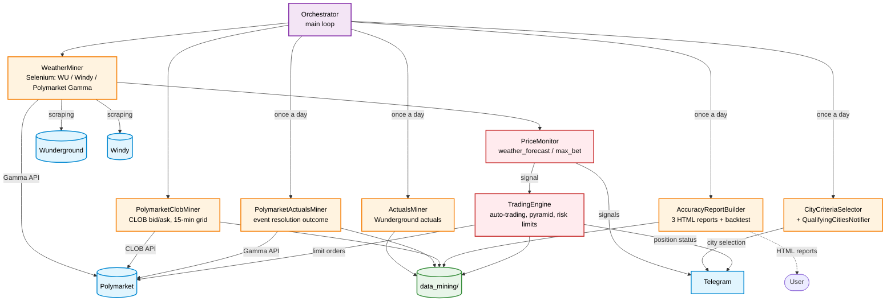

# Weather / Polymarket accuracy bot


A modular rebuild of three earlier scripts (`weather_miner.py`, `actuals_miner.py`,
`accuracy_analysis.py`), plus city selection by criteria with Telegram delivery,
live bet monitoring across TWO independent city sets and FOUR HTML reports, all
combined into one project with classes and an orchestrator.

## Architecture



`Orchestrator` runs the main loop: each iteration is either a pass of the
weather/price miners (`WeatherMiner` + `PolymarketClobMiner`) or, once a day at
the time set in `scheduler.actuals_trigger_hour`, the daily pipeline (actuals →
reports → city selection → notification). `PriceMonitor` runs INSIDE every
`WeatherMiner` pass, checking both watched-city sets independently and, with
`auto_trading: true`, calling `TradingEngine`. Each component is described in
detail in the sections below.

## Repository layout

```
README.md
report_examples/           — sample copies of the HTML reports (see "Example reports")
vps_setup/                 — VPS deployment (see "Deploying to a VPS" below)
  setup_vps.sh               — one-shot server setup (venv, systemd service, swap)
  start_bot.py               — launcher: working dir, sys.path, env vars from ~/.weather_bot_env
  weather-bot.service        — systemd unit
  check_geoblock.sh          — checks whether Polymarket allows trading from this IP
weather_bot/
  .gitignore               — keeps logs/ and data_mining/ out of git (except .gitkeep)
  requirements.txt
  config/
    config.yaml                          — all project settings, by section
    watched_icaos_weather_forecast.yaml  — set 1: city -> forecast source,
                                            correction, price range, comment
                                            (see price_monitor.weather_forecast.watched_icaos_file)
    watched_icaos_max_bet.yaml           — set 2: city -> price range,
                                            comment (no forecast source/correction:
                                            the target here is not a forecast but the
                                            market's most expensive bet itself, see below;
                                            price_monitor.max_bet.watched_icaos_file)
  run_project.ipynb        — run the project in Jupyter (interactive debugging)
  run_project.py           — standalone run outside Jupyter (for long runs)
  src/
    config.py              — loads config/config.yaml (dot access: config.paths.data_dir etc.)
    watched_icaos.py        — loads either of the two watched_icaos_*.yaml (shared format/loader)
    cities.py               — CITIES dictionary (edit only here)
    base_miner.py            — shared infrastructure for Selenium miners + logging
    telegram_client.py       — sends Telegram messages
    weather_miner.py         — WeatherMiner: weather/Polymarket (Gamma) miner, run_cycle() = one pass
    polymarket_clob_miner.py — PolymarketClobMiner: real bid/ask via the CLOB API (no Selenium), see below
    polymarket_actuals_miner.py — PolymarketActualsMiner: Polymarket's own event resolution (no Selenium), see below
    actuals_miner.py         — ActualsMiner: actuals miner, incremental, target_date is a parameter
    city_metrics.py           — shared metric functions (hits, miss streaks, bet price)
    accuracy_report.py        — AccuracyReportBuilder: DataFrame + FOUR HTML reports (see below)
    criteria.py                — CityCriteriaSelector: selects cities by criteria
    notifier.py                 — QualifyingCitiesNotifier: Telegram message + dated JSONL
    price_monitor.py            — PriceMonitor: live notifications for BOTH sets + phone calls
    orchestrator.py             — Orchestrator: wires everything together, main loop with daily pause
    trader.py                   — TradingEngine: auto-trading (see "Auto-trading" below)
    pyramid.py                  — pyramid lot formula (shared by the bot and the report backtest)
  data_mining/             — not tracked in git (only .gitkeep)
    wunderground_forcast/    — Wunderground forecast, one file per day
    windy_forcast/           — Windy forecast, one file per day
    polymarket_gamma/        — TWO kinds of records, told apart by file name (not by subfolder):
                                 polymarket_gamma_<YYYY>_<MM>_<DD>.jsonl — live slot prices 6/9/12
                                   (label + price via the Gamma API), mined strictly "in the moment", one file per day;
                                 polymarket_gamma_<YYYY>_<MM>.jsonl — Polymarket's OWN event resolution
                                   (which bucket won), can be re-mined retroactively, one file per MONTH
    polymarket_clob/         — REAL bid/ask for every Yes/No bucket (CLOB API), one file per day
    wunderground_history/    — actuals (Wunderground), one file per MONTH
    trading/                 — trade journal and trading state (see "Auto-trading")
    reports/                 — four HTML reports + qualifying_cities_<date>.jsonl (see below),
                               created by the bot on the first daily pipeline
  logs/                    — not tracked in git (only .gitkeep); one subfolder per component
                               (actuals_miner/ orchestrator/ price_monitor/ weather_miner/
                               polymarket_clob_miner/ polymarket_actuals_miner/ trader/), rotated at midnight
```

## Secrets

`weather_bot/config/config.yaml` in this repository contains placeholders instead of
real credentials: `YOUR_TELEGRAM_BOT_TOKEN`, `YOUR_TELEGRAM_CHAT_ID` (section
`telegram`) and `YOUR_WUNDERGROUND_API_KEY` (Wunderground API section). Fill them in
on the machine the bot runs on and do not commit the filled-in file. The Polymarket
wallet address and private key are never stored in `config.yaml`; they come from
environment variables (see "Auto-trading").

## Example reports

`report_examples/` holds copies of reports from real runs (October 2026):
`accuracy_report_forecast.html`, `accuracy_report_forecast_bot.html` and
`accuracy_report_max_bet_bot.html` (there is no sample of the fourth report,
`accuracy_report_max.html`, yet). GitHub shows HTML files as source code, so
download a file (the "Download raw file" button) and open it in a browser. These
are static samples: the bot writes its live reports to `data_mining/reports/`,
which is not tracked in git.

## watched_icaos_weather_forecast.yaml / watched_icaos_max_bet.yaml

Both files share one format (a `defaults` block + `watched_icaos` per city) and
are loaded by the same `src/watched_icaos.py`. A city field left empty inherits
the value from `defaults`; an explicitly set one overrides it for that city
only. `watched_icaos_max_bet.yaml` simply has no `weather_source`/`weather_corr`
fields: there is nothing for them to refer to, since the target there is not
tied to any forecast (see "How it works" below). The loader still fills them
with defaults (weather_source -> Wunderground, weather_corr -> 0); this set
uses them nowhere except as the technical `source` label in its own DataFrame.

```yaml
defaults:
  weather_source: ""
  weather_corr:
  min_price_limit:        # empty = no lower bound for any city by default
  max_price_limit: 66     # shared price ceiling if a city has none of its own

watched_icaos:
  ZSPD:
    city: "Shanghai"
    weather_source: ""      # "" = Wunderground (default), or "Windy" — weather_forecast.yaml only
    weather_corr: 1         # forecast correction IN BUCKETS/"BETS" (not in degrees):
                             # target = forecast + correction. Empty = inherits defaults.
    min_price_limit: 30.0   # LOWER bound — signal only if price >= this value.
                             # Empty = inherits defaults (also empty by default,
                             # meaning the city has no lower bound at all).
    max_price_limit:         # UPPER ceiling — signal only if price <= this value.
                             # Empty = inherits defaults (66 there).
    comment: ""              # if not empty — shown as a separate line in the Telegram notification
```

A signal (in both sets) is sent when the price of the bet on the target falls
within `[min_price_limit, max_price_limit]`. Either bound may be unset, in
which case there is no limit on that side.

## Backtest in the reports

Above the "Longest miss streak" chart (in the rating block of each
report) there is an interactive backtest: a simulation of trades on historical
data with configurable parameters. It recalculates live whenever the
period/slot/mode/era/price filter/city selection changes (click a bar, just like
the hit/miss panel, which is now shown ABOVE the backtest rather than directly
above the rating chart) or when the backtest parameters themselves change.

- **Main report** (`accuracy_report_forecast.html`) — the full set of settings:
  Strategy (Forecast/Maximum — which dataset counts as the target), Type
  (Flat/Pyramid), Number of steps (Pyramid only), Lot size (≥5.0), Fee per
  contract (0.012 USD by default), Balance (100 USD by default).
- **`accuracy_report_forecast_bot.html`/`accuracy_report_max_bet_bot.html`** — the same
  Lot size/Fee/Balance, but WITHOUT Strategy/Type/Number of steps: these are
  taken from the config of EACH city (`strategy` in `watched_icaos_*.yaml`;
  `loss_limit` is shared per strategy in `config.yaml:
  price_monitor.<set>.loss_limit` and can be overridden per city), so when
  several cities are aggregated, each can follow its own logic. The interactive
  HTML backtest still doubles the lot; the `recover`/`recover_min_multiplier`
  modes only apply to the bot's real trading.

If no city is selected, the backtest aggregates ALL cities into a single balance
curve (trades in chronological order), but the pyramid miss-streak counter is
SEPARATE for each city (each city is its own independent sequence of bets).

Logic: Flat — a fixed lot size per signal. Pyramid — the lot starts at the given
size and doubles CUMULATIVELY (5→10→20→...) with each consecutive miss, up to and
including "Number of steps" consecutive misses, then (or earlier, on a hit)
resets to the initial size. The trade price is the real bucket price for that
day (the same one already used for the marker/price in the detail panel);
payout is 1 USD per share on a hit, 0 on a miss, minus the fee per share at entry.


### Miss streaks and skipped days

Days with no data (no forecast/actual/price) and days filtered out by price or
by bot rules (grey dash in the panel) do NOT break a miss streak: only days with
a bet are counted, one after another (✗ — gaps — ✗ — ✗ = 3). This works the
same in the report rating (JS) and in city selection by criteria
(`city_metrics.compute_period`).

### Bot rules in the backtest and in the hit/miss panel

The backtest, the "Hits and misses" panel and per-city metrics (miss streaks,
hit rate) mirror the rules of real trading (values are taken from
`price_monitor` in `config.yaml` and embedded into the page when the report is
built):

- bet price **< `min_bet_price_cents`** (5¢) — no position: the day counts
  as neither a hit nor a miss, the backtest makes no trade and the pyramid miss
  counter does not change (same as the bot); the panel shows a dash, the price
  is visible and the reason appears on hover;
- market "already decided" — the most expensive bucket in the snapshot is
  **≥ `decided_market_price_cents`** (95¢) and it is not the bet bucket — same
  as above (no position);
- bets at `min_bet_price_cents` and above: the lot (after pyramid) is raised to
  `min_order_usd / price` (rounded up to 0.01 share); the backtest uses the
  increased lot, same as the bot (`_compute_lot`).

Prices come from the slot snapshot (the same price as the bot's signal). The
report decides whether a market is resolved from the slot's highest price,
while the bot uses the fresh Gamma price, so occasional discrepancies are
possible near the boundary (around 95¢).

## Price/actuals source: "old" and "new" data

Since `config.accuracy_report.data_era_cutoff_date` (default `2026-09-17`) the
project has switched from parsing Polymarket via Gamma (label + price) and
Wunderground actuals to REAL CLOB bid/ask (price = `ask_yes`, the BUY price of
Yes) and Polymarket's OWN event resolution (which bucket actually won), in all
reports built via `build_dataframe()`/`build_market_target_dataframe()`
(`accuracy_report_forecast.html`, `accuracy_report_forecast_bot.html`, `accuracy_report_max_bet_bot.html`, `accuracy_report_max.html`).

Each data row is tagged with `era`: `"old"` for dates <= cutoff (source as
before: `load_poly_bets`/`load_actuals`), `"new"` for dates after the cutoff
(source: `load_clob_bets`/`load_gamma_facts`). Both filter sets of every report
(main chart and rating block) have **Old**/**New** checkboxes, both checked by
default. Unlike the price filter, this is not a "transparent skip": an unchecked
box removes that era's dates from the calculation ENTIRELY (the chart/miss
streak is built only up to the 17th, or only from the 18th); with both unchecked
there is no data at all. The hit/miss panel shows a visual separator labelled
"old"/"new" between September 17 and 18.

## How it works

`Orchestrator.run()` runs an endless loop. Each iteration either makes one pass
of the weather miner (`WeatherMiner.run_cycle()`) followed by
`PolymarketClobMiner.run_cycle()` (see the separate section below), or, if the
time from `config/config.yaml: scheduler.actuals_trigger_hour` (Seattle time)
has come and the pipeline has not run yet today, pauses weather mining and runs
the daily pipeline:

1. `ActualsMiner.run(target_date=...)` — appends actuals for the current month
   up to and including `target_date`, mining ONLY the missing days.
2. `AccuracyReportBuilder` builds the DataFrame and saves FOUR reports, each a
   SINGLE file overwritten every day:
   - `data_mining/reports/accuracy_report_forecast.html` — full report for all cities,
     with interactive sliders for correction/price range and a
     "ignore 1 hour with the maximum" checkbox;
   - `data_mining/reports/accuracy_report_forecast_bot.html` — only cities from
     `watched_icaos_weather_forecast.yaml`, with their configured forecast
     source, correction and price range already applied FROM THE CONFIG (no
     sliders; the values are shown in the chart title when a city is selected
     and in the "Correction"/"Min. price" columns of the rating tables);
   - `data_mining/reports/accuracy_report_max_bet_bot.html` — only cities from
     `watched_icaos_max_bet.yaml`, with NO weather forecast at all: each day's
     target is the bucket of Polymarket's MOST EXPENSIVE bet in that slot, i.e.
     it checks how accurately the market itself (its own top bucket) predicts
     the actual. Both the correction slider and the "1 hour with the maximum"
     checkbox are hidden here (`show_effective_max=False`) since both relate to
     a forecast that does not exist;
   - `data_mining/reports/accuracy_report_max.html` — the same (target = the
     most expensive bet), but for ALL cities and in the full interactive view,
     like `accuracy_report_forecast.html`.

   On the "Forecast accuracy distribution" chart, bars with |error| >
   `accuracy_report.hist_max_abs_error` (default 5) are not drawn, since a rare
   outlier would stretch the axis; the number of hidden snapshots is shown
   below the chart. Ratings, the ✓/✗ panel and the backtest are computed on ALL
   data. Zero on the X axis is always centered.
3. `CityCriteriaSelector.select(df)` selects cities by three criteria
   (thresholds are in the `criteria` section of `config/config.yaml`), always
   based on the raw weather forecast, unrelated to the max_bet set.
4. `QualifyingCitiesNotifier` sends the list to Telegram and saves it to
   `data_mining/reports/qualifying_cities_<YYYY-MM-DD>.jsonl`.

Separately, INSIDE each `WeatherMiner.run_cycle()` pass (without its own loop or
pause), `PriceMonitor` runs: on the slot `config/config.yaml:
price_monitor.monitor_slot` (shared by both sets) it checks TWO INDEPENDENT city
sets and sends separate signals for each:

- **weather_forecast** (`watched_icaos_weather_forecast.yaml`) — target = the
  city's weather forecast (+ its correction). Notification header: "On
  forecast[+N]", with a link to the forecast source (Wunderground/Windy) +
  Polymarket. Call settings: `price_monitor.weather_forecast.*`.
- **max_bet** (`watched_icaos_max_bet.yaml`) — target = the bucket of the most
  expensive bet in this snapshot (no weather forecast at all, Polymarket only).
  Notification header: "On the most expensive bet", with a link to Polymarket
  only (Wunderground plays no role here). Call settings:
  `price_monitor.max_bet.*` (calls are off by default).

In both cases the signal (+ optionally a phone call via CallMeBot) is sent when
the price of the bet on the target falls within the city's
`[min_price_limit, max_price_limit]` in the corresponding file.

**The price used for this decision (and shown in Telegram)** is the REAL
`ask_yes` price from the CLOB order book, NOT the price from the Gamma API
(the one originally fetched by `WeatherMiner.scrape_polymarket`: the last
recorded trade/quote, with no order-book depth, which can differ noticeably
from the real buy price on low-liquidity buckets). The two sets work
differently:

- **weather_forecast** — the target bucket is known in advance from the
  forecast + correction (Gamma plays no role at all); CLOB
  (`PolymarketClobMiner.fetch_live_price`, a one-off request for ONE bucket)
  only refines its PRICE.
- **max_bet** — the target bucket IS "the most expensive bet", so the
  SELECTION itself also goes through CLOB: `PolymarketClobMiner.fetch_live_top_bucket`
  compares the real prices of ALL buckets of the event in ONE batch request and
  takes the maximum. The real "most expensive" bucket may differ from what
  Gamma would show based on last trade prices.

Both requests are made at signal time. They are unrelated to the background
15-minute mining in `PolymarketClobMiner.run_cycle()` below, though they reuse
its intraday Gamma → `clobTokenIds` bucket resolution cache if it is already
warm. If the live request fails (network, event/bucket/price not found), there
is a silent fallback to Gamma data, so a failure of the SECOND price source
does not kill the signal entirely.

### PolymarketClobMiner — real bid/ask (independent of everything above)

A component separate from `WeatherMiner`/`PriceMonitor`: on a 15-minute grid
(`config.polymarket_clob_miner.slot_minutes`, default :00/:15/:30/:45) in the
LOCAL time of EACH city, only within the daytime window
`[slot_start_hour, slot_end_hour)` (default 06:00–18:00), it fetches the REAL
bid/ask for every bucket (Yes and No) of the Polymarket event. Not via the Gamma
API (which only has the last price, not the full book) but via the CLOB API
(`POST https://clob.polymarket.com/books`), using plain HTTP requests
(`requests`), WITHOUT Selenium/a browser.

When several cities reach a not-yet-captured slot in the same pass, all their
token_ids (Yes+No for every bucket) go out in ONE batch request to the CLOB API
(up to `clob_batch_chunk_size` tokens at a time, API limit 500) rather than one
per city. Writes to `data_mining/polymarket_clob/`, one file per day (the
city's local date): `{"date", "icao", "city", "snapshot_slot",
"snapshot_timestamp", "bucket", "bid_yes", "ask_yes", "bid_no", "ask_no"}`,
one row per bucket of every captured slot.

Background mining (`run_cycle()`, this section) is not yet connected to any of
the reports above; it is a separate data source for future use. The class
ITSELF, however, is already used live, outside its slot loop, by `PriceMonitor`
signals (see above, `fetch_live_price` + `Orchestrator._fetch_live_clob_price_now`)
to get the real ask_yes price of ONE specific bucket at signal time.

The bot's decision snapshot (`_write_live_snapshot`) is written as the current
grid slot (e.g. "12:15") and, if the "HH:00" slot of that hour has not been
captured yet, ALSO as "HH:00": when a loop pass is late (Chrome/network pause,
the hour's first pass at 12:15), the report/backtest looking for slot "12:00"
still finds the same price the bot traded at rather than an empty cell.

### PolymarketActualsMiner — Polymarket's OWN event resolution (independent of everything above)

A component separate from `ActualsMiner` (Wunderground actuals): the actual
outcome according to the Polymarket market ITSELF, i.e. which bucket actually won
that day, based on `outcomePrices` of the resolved event ("Yes" ≈ 1 for the
winner). Uses the Gamma API (`requests`), WITHOUT Selenium: by mining time the
event is usually already closed and the winning bucket is visible immediately,
without scraping the page.

The same `run(target_date=...)` / `mine_missing_for_month(year, month,
up_to_date)` methods (the month is a function parameter) are used in both modes:
- **Automatically** — called FROM THE DAILY PIPELINE of `Orchestrator`
  (`_run_daily_pipeline`), RIGHT AFTER `actuals_miner.run()`, with the same
  `target_date`, for ALL cities at once (the same principle as `ActualsMiner`).
  There used to be a separate "start of day for EACH city individually" trigger
  (`run_cycle()`, one per time zone); it was dropped because by midnight Seattle
  time (when `_run_daily_pipeline` fires, see below) the day is guaranteed to
  have ended for ALL cities in `cities.py`.
- **Manually/catch-up** — from the notebook, for an arbitrary (not necessarily
  current) month, to reload it entirely.

Both calls use THE SAME monthly files for deduplication, so they never duplicate
each other's data. Writes to THE SAME `data_mining/polymarket_gamma/` as the live
slot prices; only the file name differs:
`polymarket_gamma_<YYYY>_<MM>.jsonl` (this miner, one file per MONTH) vs
`polymarket_gamma_<YYYY>_<MM>_<DD>.jsonl` (live prices, one file per day).
`{"date", "icao", "city", "bucket", "scale"}` — `bucket` is the LABEL (a range,
not a single number, unlike `max_temp_f` in the Wunderground actuals) of the
winning outcome, `scale` is derived from the °F/°C symbol in the label.

After the daily pipeline, weather mining continues on the next loop iteration
as usual.

### Maximum signal delay (`price_monitor.max_signal_delay_min`)

The signal check runs on any loop pass during the `monitor_slot` hour (once a
day per city). If the bot was stopped/restarted or the network went down, the
first successful pass may come late (e.g. at 12:48), when the price is no longer
the slot price. `max_signal_delay_min` (default 15) sets how many minutes after
the slot start a pass may be late (to the minute: 12:15:48 with a limit of 15
passes, 12:16 does not). When late, the city is marked as checked, no position
or signal is created, and a single "Signal skipped — too late" message goes to
the log and Telegram. `0`/`null` means no limit (the window is the whole hour,
as before). The backtest still counts such days as trades at the slot price;
in reality they will not exist.

## Auto-trading (TradingEngine, src/trader.py)

Real trades happen ONLY when `price_monitor.<set>.auto_trading: true` (set
separately for each set, `weather_forecast`/`max_bet`; both `false` by
default). Positions are opened by THE SAME logic as the interactive report
backtest (lot/pyramid/P&L match one to one). The limit order uses the city's
`max_price_limit` (or `defaults`) from the corresponding `watched_icaos_*.yaml`,
for `price_monitor.<set>.lot_size` shares. For `strategy: "pyramid"`, the lot
after a miss is set by `price_monitor.<set>.pyramid_mode` (separately for each
set): `double` — `lot_size * streak multiplier`, where the progression is set by
`pyramid_progression` (`power`: m^k = 1, 2, 4, 8; `cumulative`: 1+m+…+m^k = 1, 3, 7, 15;
`custom`: the `pyramid_custom_steps` list), m = `pyramid_multiplier`; the config
default is `cumulative` with m=2 (the formula is in `src/pyramid.py`, and the
report backtest uses it too);
`recover` — a lot that recovers the streak's accumulated loss plus a target
profit of `lot_size * pyramid_target_profit_price` (default `5 * 0.5 = $2.5`),
at the signal price and including fees; `recover_min_multiplier` — the same,
but no less than the previous lot times `pyramid_multiplier`. `loss_limit`
(how many bets in a row per streak) is set in the same place, in the strategy
settings. In any mode the lot is no less than `price_monitor.min_order_usd / price`
(Polymarket's minimum order size, 1 USD), and if the signal price is below
`price_monitor.min_bet_price_cents` (default 5¢), no position is opened at all
and a "Position not opened" notification is sent to Telegram. The lot is rounded
up to 0.01 share; `pyramid_max_lot` (default `null`) is an optional cap. The
streak state (accumulated loss and last lot) is stored in `pyramid_state.json`
under the key `<set>|<icao>|series`.

**Required before enabling it for the first time:**

1. **Environment variables** — the wallet's private key is NEVER stored in
   `config.yaml` (the file lives in the repository). Set them before starting
   (on a VPS: in `/home/bot/.weather_bot_env`, see "Deploying to a VPS"; in
   Jupyter: e.g. in the very first cell of `run_project.ipynb` via `getpass`,
   as in the ad-hoc script used to test order placement):
   ```python
   import os, getpass
   os.environ["POLYMARKET_WALLET_ADDRESS"] = getpass.getpass("POLYMARKET_WALLET_ADDRESS")
   os.environ["POLYMARKET_PRIVATE_KEY"] = getpass.getpass("POLYMARKET_PRIVATE_KEY")
   ```
   Without them, `TradingEngine` fails with a clear error in the log/Telegram on
   the first real trade; the rest of the bot (mining, reports, Telegram
   signals) keeps working as usual.
2. **`test_cities_limit`** (default 2, separately for each set) — the bot
   actually trades only the FIRST N cities IN ORDER in the corresponding
   `watched_icaos_*.yaml` (top to bottom), even if `auto_trading: true` and the
   file has more cities. The rest still get a Telegram signal, just without a
   real trade — a way to limit risk until the logic has been proven in practice.
3. **`price_monitor.account_balance`** — the account size in USD, the base for
   both risk limits below AND for the % in the daily summary (see below). Set it
   according to your real deposit.

**Risk management** is based on REALIZED P&L (as in the backtest: the balance
moves only when a position is closed by the actual outcome; open positions do
not count toward the limit):
- `price_monitor.<set>.strategy_max_loss_pct` (default **15%**) — when exceeded,
  ONLY that set (`weather_forecast` or `max_bet`) stops.
- `price_monitor.risk.total_max_loss_pct` (default **30%**) — when the combined
  loss of BOTH sets exceeds it, ALL auto-trading stops.
- In both cases a Telegram notification is always sent; a CallMeBot call is made
  if `risk_call_alert_enabled: true` is set for the set (using its own
  `call_user`/`call_max_attempts`/`call_retry_delay_sec`) or
  `price_monitor.risk.call_alert_enabled: true` for the total limit.
- The halt is a persistent flag (`data_mining/trading/risk_state.json`, survives
  bot restarts): to resume trading after a manual review, set `"halted": false`
  in that file (or delete the key of the corresponding strategy/`_total`); the
  bot never switches it back to `true` on its own.

**Orders** are limit BUY orders, `GTC` (Good-Till-Cancelled): if an order is not
filled within `price_monitor.fill_check_wait_sec` seconds (default **20**), the
bot does NOT cancel it; it stays in the order book. The result of the FIRST check
(filled/not filled within the allotted time) is immediately written to the log
and the JSONL AND sent as a separate Telegram message:
```
✅ Позиция открыта за 20 сек #Seoul
Max bet 27°C на 5.0 по 42.0¢ | Polymarket
```
(the price is the REAL fill price, not the order's limit price: it is taken from
`list_positions()`, since `get_order()` does not return it, see
`_OrderClient.get_fill_price` in `src/trader.py`, with a fallback to the limit
price if the position has not appeared in the list yet)
(for "not filled" — similarly, plus how much was actually filled and the order
status). If the order remains open, the bot does not poll it again until the
market outcome for that day/city is known, but before computing its P&L,
`resolve_positions()` queries the exchange AGAIN: if the order was filled (fully
or partially) AFTER the first check, P&L is computed on the actually filled
size; if it never filled, the position is closed with P&L = 0 and is not counted
as a pyramid miss (there was no trade).

**max_bet consistency with the backtest.** The backtest reads the CLOB snapshot
of the `monitor_slot` slot (12:00) and takes the bucket with the highest
`ask_yes`. To make the bot choose from exactly the same data, the live top-bucket
request (`fetch_live_top_bucket`) fetches the Yes+No order books in one batch and
immediately records them as the current slot's snapshot (if not captured yet);
the miner's `run_cycle` does not overwrite that slot afterwards. The bot's
decision and the backtest snapshot come from the same request. The same applies
to the weather_forecast set: the live price of the target bucket
(`fetch_live_price`) is taken from the same event order books (all Yes+No tokens,
one request per city and slot, cached in memory), not from a separate request
for a single token. If a city is in both sets, both signals get the same books:
signal price = snapshot price = report price (hits/misses).
If live CLOB is unavailable (the request failed or the bucket has no ask),
PriceMonitor falls back to the Gamma price, and the bot writes that same price
to the `polymarket_clob_*.jsonl` journal as `ask_yes` (`bid_*` empty, field
`"source": "gamma"`). If the request fails completely, the slot is marked as a
"Gamma slot": the miner does not overwrite it, and the second strategy set for
the same city also gets the Gamma price. This way the price in the signal, the
report and the backtest match even on fallback.
The fallback Gamma price is FRESH: `fetch_gamma_bets` re-requests the event from
Gamma once per city and slot (both strategy sets share the result) instead of
taking the price from the daily cache (filled on first access, usually ~06:00).
Buckets and tokens stay from the cache; if the request fails, the cached price
is kept. Also, if the day's first request failed and cached an empty list, the
fresh response replaces it.

**Daily Telegram summary** (`price_monitor.daily_summary_enabled`, default
`true`) — once a day, right after the daily pipeline resolves positions (see
"Running locally" below), computed from the journal files
`data_mining/trading/trades_*.jsonl` (so it is not reset by bot restarts; it
only includes positions that were actually filled and resolved by the
outcome). Format:
```
📊 Сводка ставок на Polymarket за 2026-09-20
Баланс: 115.50$ | 🟢+15.50$ | 🟢+15.5%
2 города: 🟢+5.50$ | 🟢+5.5%
#Seattle: 🟢+5.50$ | 🟢+10.00$ (+10.0%)
#Los_Angeles: 🔴-2.00$ | 🟢+8.00$ (+8.0%)
```
The "Balance" line shows the current balance, total P&L and % since the journal
began (across all strategies and cities). The "N cities" line shows how many
cities were resolved during the DAY and their combined P&L/% for the day. Each
city line (values separated by `|`) shows P&L for the day in USD, P&L for ALL time
in USD, and P&L for all time in % (no emoji; the city name is a hashtag
(#Los_Angeles); the percentage is in parentheses after the all-time amount).
Telegram bot messages do not support text color (only `<b>`/`<i>`/code/links),
so instead of literally "colored numbers", profit/loss is marked with 🟢/🔴
before each amount — the closest practical equivalent within the Bot API.

**Journal** (`data_mining/trading/`):
- `trades_<YYYY_MM_DD>.jsonl` — per day (position open date), one JSON record
  PER POSITION, rewritten as its status changes. These files can later be used
  to build a real-trading chart similar to the report backtest, and the daily
  summary above is computed from them.
- `open_positions.json` / `pyramid_state.json` / `risk_state.json` — current
  state (open positions, pyramid miss counter per city, accumulated P&L/halted
  flags). Re-read on EVERY start, so restarting the bot does not lose open
  positions or break the pyramid chain.
- `deferred_notifications.json` — a queue of "Position closed" messages for
  positions resolved before the nightly resolution (synchronously before a new
  signal for the same city): to avoid cluttering the chat on every signal, they
  are sent at the next nightly resolution (Seattle time) together with the rest;
  stored on disk, so a bot restart does not lose them.
- `checked_today.json` — PriceMonitor's "city/set already checked today" dedup
  (see `PriceMonitor._checked_today`), also re-read on start. Without this file,
  restarting the bot during the day would resend a signal already sent today to
  Telegram (although a separate guard in `TradingEngine.on_signal` already
  prevents duplicating the real position). Records older than 3 days are pruned
  automatically on every save.

Component logs: `logs/trader/trader.log`.

**Strongly recommended** before going live for the first time: verify that
`POLYMARKET_WALLET_ADDRESS`/`POLYMARKET_PRIVATE_KEY` are correct with a test run
using `test_cities_limit: 1` and a small `lot_size`, and watch
`logs/trader/trader.log`/Telegram for at least a day before expanding the list of
traded cities.

## Deploying to a VPS

The `vps_setup/` folder contains everything needed to run the bot as a systemd
service on a Linux VPS (tested on Vultr, Stockholm). The bot runs as the `bot`
user from `/home/bot/weather_bot` in the venv `/home/bot/venv`.

1. Get the code onto the server, either by cloning the repository:
   ```
   git clone https://github.com/alexandercbgm/meteo_trading_bots.git /root/meteo_trading_bots
   ```
   or by uploading a zip of the `weather_bot/` folder together with `vps_setup/`
   (PowerShell or WinSCP):
   ```
   scp -r weather_bot_113.zip vps_setup root@SERVER_IP:/root/
   ```
2. On the server, run the setup as root:
   ```
   bash /root/meteo_trading_bots/vps_setup/setup_vps.sh          # from the repository clone
   bash /root/vps_setup/setup_vps.sh /root/weather_bot_113.zip   # or from a zip
   ```
   The script first checks the server IP with `check_geoblock.sh` and stops if
   Polymarket blocks it. It then installs Python, adds 1 GB of swap, creates the
   `bot` user, copies the bot to `/home/bot/weather_bot`, installs
   `requirements.txt` into the venv and enables the `weather-bot` service.
   When installing from the repository, an existing
   `/home/bot/weather_bot/config/config.yaml` is kept, so re-running the script
   to update the code does not wipe your filled-in secrets.
3. Fill in the wallet keys: `nano /home/bot/.weather_bot_env`
   ```
   POLYMARKET_WALLET_ADDRESS=0x...
   POLYMARKET_PRIVATE_KEY=...
   ```
   `start_bot.py` loads these variables into the environment before starting
   `run_project.py`.
4. Fill in the secrets in `/home/bot/weather_bot/config/config.yaml` (Telegram
   token, chat_id, Wunderground API key; see "Secrets").
5. Start: `systemctl start weather-bot`
6. Logs: `journalctl -u weather-bot -f` (or `/home/bot/weather_bot/logs/`)

Useful commands:
```
systemctl status weather-bot      status
systemctl restart weather-bot     restart after editing config.yaml
systemctl stop weather-bot        stop
bash vps_setup/check_geoblock.sh  check the IP
```
If you want to keep the state (`data_mining/trading`: `open_positions.json`,
`pyramid_state.json`, ...), copy it over from the previous location so the
pyramid streaks are not reset.

## Running locally

Run everything below from the `weather_bot/` folder (paths such as
`config/config.yaml` are relative to it); install dependencies with
`pip install -r requirements.txt`.

1. Start Chrome with remote debugging (as before):
   ```
   start chrome.exe --remote-debugging-port=9222 --user-data-dir="C:\bot_chrome_profile"
   ```
   If a VPN is needed to access Polymarket, it must now be configured **at the
   machine level** (a desktop VPN app covering all of the machine's network
   traffic), not as a browser extension. Previously this did not matter, since
   all Polymarket access went through Chrome itself (scraping the Gamma API right
   from the page). Now some of the data (`PolymarketClobMiner`, `PolymarketActualsMiner`
   and the ad-hoc trading script) goes to Polymarket directly via `requests`,
   bypassing the browser entirely, so a browser VPN does not apply to these
   requests.

   If you see "did not finish within 30 sec" in the log when Selenium connects
   to Chrome (github.com/SeleniumHQ/selenium/issues/14906, a known open Selenium
   bug), try switching between tabs in Chrome, or kill ALL `chrome.exe`
   processes (via Task Manager, not just closing the window) and start it again
   with the command above.

   Additionally (one-time, for calls via CallMeBot; see "VPN dropout check"
   and `call_user`/`call_alert_enabled` in `config/config.yaml`): you need to
   authenticate once in the browser at
   https://www.callmebot.com/blog/telegram-phone-call-using-your-browser/.
   Without it, Telegram calls (unlike the old WhatsApp option) will not work.
   Save the resulting link in the config.
2. Check/adjust `config/config.yaml` (fill in the Telegram token, chat_id and
   Wunderground key — see "Secrets"; criteria thresholds are in the `criteria`
   section, both monitoring sets in `price_monitor.weather_forecast`/`price_monitor.max_bet`)
   and both `config/watched_icaos_weather_forecast.yaml` /
   `config/watched_icaos_max_bet.yaml`.
3. For interactive debugging, open `run_project.ipynb` and run the cells in
   order; it also has separate cells for running components one at a time,
   without the main endless loop.
4. For a real multi-day run, prefer `python run_project.py` in a separate console
   (or via Windows Task Scheduler) over the notebook. The reason: Jupyter/ipykernel
   has a known quirk where, when ONE cell runs for many hours, output sometimes
   stops reaching the browser (the process itself is alive and the log files keep
   growing normally, but the kernel status may show Unknown and the cell goes
   "silent"). `build_logger` already mitigates this (see `_JupyterSafeStream` in
   `src/base_miner.py`), but there is no full guarantee while running inside a
   notebook kernel; `run_project.py` avoids this whole class of problems by
   running as a regular process.

Component logs are separate files in their OWN `logs/` subfolders:
`logs/weather_miner/weather_miner.log`, `logs/actuals_miner/actuals_miner.log`,
`logs/orchestrator/orchestrator.log`, `logs/price_monitor/price_monitor.log`
(the latter records every single check of a watched city at the monitoring slot
for BOTH sets, prefixed with `[прогноз]`/`[max ставка]`, including cases with no
signal because the price is out of range), `logs/polymarket_clob_miner/polymarket_clob_miner.log`,
`logs/polymarket_actuals_miner/polymarket_actuals_miner.log`.

## VPN dropout check

`BaseSeleniumMiner._check_vpn_dropped` (used by `WeatherMiner` and
`ActualsMiner`, both of which load Wunderground/Polymarket pages via Selenium)
triggers on TWO independent signs right on the page when a page load ends in an
error:

1. **Wunderground opened but is geoblocked** — the `<body>` contains the text
   `This content is no longer available in your area` (the VPN dropped or is
   using the wrong region).
2. **Polymarket did not open at all** — Chrome's own error page contains
   `Не удается получить доступ к сайту` ("This site can't be reached") at a
   fixed xpath.

In both cases `🔴 Не удалось открыть Wunderground/Polymarket, проверьте VPN.`
("Could not open Wunderground/Polymarket, check the VPN.") is ALWAYS sent to
Telegram, plus a CallMeBot call if `vpn_check.call_alert_enabled: true` (default
`true`; settings are in the `vpn_check` section of `config/config.yaml`, using
the same `call_user`/`call_max_attempts`/`call_retry_delay_sec` as the trader's
risk calls). Deduplication: no more than once every 5 minutes
(`VPN_ALERT_COOLDOWN_SEC` in `base_miner.py`), so Telegram is not spammed and no
call is made on every subsequent snapshot, while the alert is still repeated
(again `call_max_attempts` call attempts) as long as the VPN is still down.

**`PolymarketClobMiner`** works without Selenium/a browser (plain HTTP requests
via `requests`, see the header of `polymarket_clob_miner.py`), so the
"text on the page" check above does not apply to it. It has its own check with
the same intent: `PolymarketClobMiner._report_connection_down` triggers when a
request to the Gamma API (`_fetch_event_markets`) or to CLOB `/books`
(`_fetch_order_books`) fails with a TCP/DNS/timeout-level network error
(`requests.exceptions.ConnectionError`/`Timeout`, e.g. "Failed to establish a new
connection", as when Polymarket access is blocked without a VPN), NOT on regular
API errors (HTTP status, broken JSON, etc.). Telegram receives
`🔴 Не удалось выполнить запрос к API Polymarket, проверьте VPN.` ("Could not
complete the request to the Polymarket API, check the VPN."; the wording differs
from the browser check above: there it is "open the page", here it is "API
request"), with the same CallMeBot call and the same `VPN_ALERT_COOLDOWN_SEC`
dedup window, but independent of `BaseSeleniumMiner` (its own last-alert timer,
since it is a separate object/process).

## Changes compared to the original scripts

- `weather_miner.py`: the logic is the same, but `run()` is split into
  `run_cycle()` (one pass, no sleep), driven by `Orchestrator`; all constants
  moved to `config/config.yaml`.
- `actuals_miner.py`: previously the month file was rewritten from scratch on
  every run. Now it reads what has already been mined and mines ONLY the missing
  days (append, not overwrite). The day to mine up to is an explicit `target_date`
  parameter (a single date, a range tuple or an explicit list of dates).
- `accuracy_analysis.py`: the chart and rating logic moved to
  `AccuracyReportBuilder`; the pieces shared by the ratings and criteria-based
  selection moved to `city_metrics.py`. Added interactive sliders for the
  forecast correction and the bet price range (they recalculate charts and tables
  live, including correct miss-streak counting: a day filtered out by price is
  "transparent" and does not break the streak, unlike a genuinely missing day,
  which does).
- New: `criteria.py` + `notifier.py` — city selection by criteria and delivery.
  Selection is based STRICTLY on Wunderground (no fallback to Windy): a city with
  no Wunderground data for the required period simply does not qualify.
- New: `watched_icaos.py` + `price_monitor.py` (two independent signal sets) +
  two "adjusted" reports
  (`AccuracyReportBuilder.build_watched_report`/`build_market_target_report`)
  — `watched_icaos_weather_forecast.yaml`/`watched_icaos_max_bet.yaml`
  as the single source of truth for which cities to monitor, with which target
  (forecast with correction OR the most expensive bet) and price range.
- New: `polymarket_clob_miner.py` — real bid/ask via the CLOB API (see the
  section above), not via Selenium.
- `data_mining/` is no longer a flat folder: WU/Windy/Polymarket (Gamma)/actuals
  used to be written together into `weather_<date>.jsonl`/`actuals_<month>.jsonl`
  at the root; now each data type has its own subfolder (see "Repository layout"
  above). For data already accumulated under the old scheme there is a separate
  migration script (run manually, once): it reads the old files and sorts them
  into the new folders without deleting the originals and without duplicating
  records when re-run.

**Order status check after submission** (`price_monitor.status_check_attempts`=3,
`status_check_delay_sec`=2). If `get_order_status` fails, it is retried up to 3
times with a pause; if the status still cannot be read, the bot checks the real
position in `list_positions`: if found, the order is considered filled (fully or
partially); if not, "could not verify" (the order is not re-placed, and the
status is re-checked when the position is resolved).

**Backtest chart (HTML reports).** The backtest and actual lines are drawn as
one smooth curve (a cubic spline through all points) rather than separate
splines per color segment; the color (above/below the start) changes exactly at
the point where the line crosses the starting level. The X axis is numeric;
date labels are set via `tickvals/ticktext` (thinned out on long periods).

**Market "already decided"** (`price_monitor.decided_market_price_cents`, default 95).
If the most expensive bucket on Gamma (fresh price at check time) is >= this
threshold and it is NOT the bot's bet bucket (for max_bet, not the "most
expensive" one chosen via CLOB; for the forecast, not the target), no signal or
position is opened: the day's outcome is already known, a bet on any other
bucket is a sure loss (~0.1¢), and the `min_order_usd` floor used to inflate its
lot to hundreds of shares (bets cheaper than `min_bet_price_cents` are now
skipped), while the order limit was set at `max_price_limit`, which caused
"not enough balance" errors. The reason is written to the log. 0/null disables
the check.
