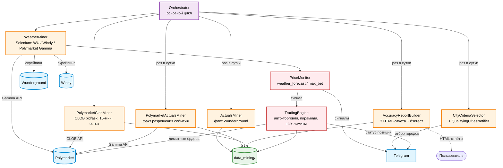

# Weather / Polymarket accuracy bot


Модульная сборка трёх прежних скриптов (`weather_miner.py`, `actuals_miner.py`,
`accuracy_analysis.py`) плюс отбор городов по критериям и рассылка в Telegram,
"на лету" мониторинг ставок по ДВУМ независимым наборам городов и ТРИ HTML-отчёта
— в один проект с классами и оркестратором.

## Архитектура



`Orchestrator` крутит основной цикл: каждую итерацию — либо проход майнеров
погоды/цен (`WeatherMiner` + `PolymarketClobMiner`), либо — раз в сутки, в
момент из `scheduler.actuals_trigger_hour` — дневной пайплайн (факт →
отчёты → отбор городов → уведомление). `PriceMonitor` работает ВНУТРИ
каждого прохода `WeatherMiner`, независимо проверяя оба набора watched-
городов и, при `auto_trading: true`, дёргая `TradingEngine`. Подробности
каждого компонента — в разделах ниже.

## Структура

```
config/
  config.yaml                          — все параметры проекта, по секциям
  watched_icaos_weather_forecast.yaml  — набор 1: город -> источник прогноза,
                                          поправка, диапазон цены, комментарий
                                          (см. price_monitor.weather_forecast.watched_icaos_file)
  watched_icaos_max_bet.yaml           — набор 2: город -> диапазон цены,
                                          комментарий (без источника/поправки
                                          прогноза — таргет тут не прогноз, а
                                          сама дорогая ставка рынка, см. ниже;
                                          price_monitor.max_bet.watched_icaos_file)
requirements.txt
run_project.ipynb        — запуск проекта в Jupyter (интерактивная отладка)
run_project.py           — автономный запуск вне Jupyter (для долгих прогонов)
src/
  config.py              — загрузка config/config.yaml (точечный доступ: config.paths.data_dir и т.п.)
  watched_icaos.py        — загрузка любого из двух watched_icaos_*.yaml (общий формат/загрузчик)
  cities.py               — словарь CITIES (правь только здесь)
  base_miner.py            — общая инфраструктура Selenium-майнеров + логирование
  telegram_client.py       — отправка сообщений в Telegram
  weather_miner.py         — WeatherMiner: майнер погоды/Polymarket(Gamma), run_cycle() = один проход
  polymarket_clob_miner.py — PolymarketClobMiner: реальные bid/ask по CLOB API (без Selenium), см. ниже
  polymarket_actuals_miner.py — PolymarketActualsMiner: факт собственного разрешения события Polymarket (без Selenium), см. ниже
  actuals_miner.py         — ActualsMiner: майнер факта, инкрементальный, target_date параметризован
  city_metrics.py           — общие функции метрик (попадания, серии промахов, цена ставки)
  accuracy_report.py        — AccuracyReportBuilder: DataFrame + ТРИ HTML-отчёта (см. ниже)
  criteria.py                — CityCriteriaSelector: отбор городов по критериям
  notifier.py                 — QualifyingCitiesNotifier: сообщение в Telegram + JSONL с датой
  price_monitor.py            — PriceMonitor: "на лету" уведомления по ОБОИМ наборам + звонки
  orchestrator.py             — Orchestrator: связывает всё, основной цикл с ежедневной паузой
data_mining/
  wunderground_forcast/    — прогноз Wunderground, по файлу на сутки
  windy_forcast/           — прогноз Windy, по файлу на сутки
  polymarket_gamma/        — ДВА типа записей, различаются по имени файла (не по подпапке):
                               polymarket_gamma_<YYYY>_<MM>_<DD>.jsonl — живые цены слотов 6/9/12
                                 (лейбл+цена через Gamma API), майнятся строго "в моменте", по файлу на сутки;
                               polymarket_gamma_<YYYY>_<MM>.jsonl — факт СОБСТВЕННОГО разрешения
                                 события (какой бакет выиграл), можно перемайнить задним числом, по файлу на МЕСЯЦ
  polymarket_clob/         — РЕАЛЬНЫЕ bid/ask по каждому бакету Yes/No (CLOB API), по файлу на сутки
  wunderground_history/    — факт (Wunderground), по файлу на МЕСЯЦ (без изменений в этой части)
  reports/                 — три HTML-отчёта + qualifying_cities_<дата>.jsonl (см. ниже)
logs/                       — по подпапке на компонент (actuals_miner/ orchestrator/ price_monitor/
                               weather_miner/ polymarket_clob_miner/ polymarket_actuals_miner/), внутри — ротация в полночь
```

## watched_icaos_weather_forecast.yaml / watched_icaos_max_bet.yaml

Оба файла — один и тот же формат (блок `defaults` + `watched_icaos` по
городу), грузятся одним и тем же `src/watched_icaos.py`. Поле города,
оставленное пустым, наследует значение из `defaults`; заданное явно —
переопределяет его только для этого города. У `watched_icaos_max_bet.yaml`
просто нет полей `weather_source`/`weather_corr` — им неоткуда взяться,
таргет там не привязан ни к какому прогнозу (см. "Как это работает" ниже), но
загрузчик всё равно подставит им дефолт (weather_source -> Wunderground,
weather_corr -> 0) — это не используется этим набором нигде, кроме
технической метки source в его собственном DataFrame.

```yaml
defaults:
  weather_source: ""
  weather_corr:
  min_price_limit:        # пусто = ограничения снизу нет ни у одного города по умолчанию
  max_price_limit: 66     # общий потолок цены, если у города не задан свой

watched_icaos:
  ZSPD:
    city: "Shanghai"
    weather_source: ""      # "" = Wunderground (по умолчанию), или "Windy" — только для weather_forecast.yaml
    weather_corr: 1         # поправка к прогнозу В БАКЕТАХ/"СТАВКАХ" (не в градусах):
                             # таргет = прогноз + поправка. Пусто = наследует defaults.
    min_price_limit: 30.0   # НИЖНИЙ порог — сигнал только если цена >= этого значения.
                             # Пусто = наследует defaults (там тоже пусто по умолчанию —
                             # значит нижней границы для города нет вовсе).
    max_price_limit:         # ВЕРХНИЙ потолок — сигнал только если цена <= этого значения.
                             # Пусто = наследует defaults (там 66).
    comment: ""              # если не пусто — отдельной строкой в уведомлении в Telegram
```

Сигнал (в обоих наборах) шлётся, когда цена ставки на таргет попадает в
диапазон `[min_price_limit, max_price_limit]` — любая из границ может быть не
задана (тогда с этой стороны ограничения просто нет).

## Бэктест в отчётах

Над графиком «Самая длинная череда промахов» (в блоке рейтингов каждого из
трёх отчётов) — интерактивный бэктест: симуляция сделок по историческим
данным с настраиваемыми параметрами, пересчитывается на лету при изменении
периода/слота/режима/эры/фильтра цены/выбора города (клик по столбцу — как и
у панели с крестиками/галочками, которая теперь показывается НАД бэктестом,
а не над графиком-рейтингом напрямую) или самих параметров бэктеста.

- **Основной отчёт** (`accuracy_report.html`) — полный набор настроек:
  Стратегия (Прогноз/Максимум — какой датасет считать таргетом), Тип
  (Плоская/Пирамида), Количество шагов (только для Пирамиды), Размер лота
  (≥5.0), Комиссия на контракт ($0.012 по умолчанию), Баланс ($100 по
  умолчанию).
- **`accuracy_report_watched.html`/`accuracy_report_max_bet.html`** — тех же
  Размер лота/Комиссия/Баланс, но БЕЗ Стратегии/Типа/Количества шагов — они
  берутся из конфига КАЖДОГО города (`strategy` в `watched_icaos_*.yaml`,
  `loss_limit` — единое для стратегии в `config.yaml:
  price_monitor.<набор>.loss_limit`, при желании переопределяется у города),
  так что при агрегации нескольких городов сразу у каждого может быть своя
  логика. Интерактивный бэктест HTML-отчётов по-прежнему удваивает лот —
  режимы `recover`/`recover_min_multiplier` действуют только в реальной торговле бота.

Если город не выбран — бэктест агрегирует ВСЕ города сразу в одну кривую
баланса (сделки идут в хронологическом порядке), но счётчик серии промахов
для пирамиды — ОТДЕЛЬНЫЙ по каждому городу (город = своя независимая
последовательность ставок).

Логика: Плоская — фиксированный размер лота на каждый сигнал. Пирамида —
лот начинается с заданного и удваивается НАКОПИТЕЛЬНО (5→10→20→...) при
каждом промахе подряд, до достижения "Количество шагов" промахов подряд
включительно — затем (или раньше, при попадании) сбрасывается к исходному
размеру. Цена сделки — реальная цена бакета на тот день (та же, что уже
использовалась для маркера/цены в панели детализации), выкуп: $1/акция при
попадании, $0 при промахе, минус комиссия на каждую акцию при входе.


### Череда промахов и пропущенные дни

Дни без данных (нет прогноза/факта/цены) и дни, отфильтрованные по цене или правилам бота (серый прочерк в панели),
серию промахов НЕ рвут: считаются только дни со ставкой, подряд друг за другом (✗ — пропуски — ✗ — ✗ = 3).
Одинаково в рейтинге отчёта (JS) и в отборе городов по критериям (`city_metrics.compute_period`).

### Правила бота в бэктесте и в панели галочек/крестиков

Бэктест, панель «Попадания и промахи» и метрики по городам (серии промахов,
hit rate) повторяют правила реальной торговли (значения берутся из
`price_monitor` в `config.yaml`, при сборке отчёта вшиваются в страницу):

- цена ставки **< `min_bet_price_cents`** (5¢) — позиции нет: день не считается
  ни попаданием, ни промахом, в бэктесте сделки нет и счётчик промахов пирамиды
  не меняется (как у бота); в панели — прочерк, цена видна, при наведении
  причина;
- рынок «уже решён» — самый дорогой бакет снапшота **≥ `decided_market_price_cents`**
  (95¢) и это не бакет ставки — то же самое (позиции нет);
- ставка от `min_bet_price_cents` и выше: лот (после пирамиды) поднимается до
  `min_order_usd / цена` (округление вверх до 0.01 акции) — в бэктесте считается
  по увеличенному лоту, как у бота (`_compute_lot`).

Цены берутся из снапшота слота (та же цена, что у сигнала бота); решённость
рынка определяется по самой дорогой цене слота в отчёте, у бота — по свежей цене
Gamma, поэтому на границе (около 95¢) возможны единичные расхождения.

## Источник цены/факта: "старые" и "новые" данные

С `config.accuracy_report.data_era_cutoff_date` (по умолчанию `2026-09-17`)
проект переключился с парсинга Polymarket через Gamma (лейбл+цена) и факта
Wunderground на РЕАЛЬНЫЙ CLOB bid/ask (цена — `ask_yes`, цена ПОКУПКИ Yes) и
СОБСТВЕННОЕ разрешение события Polymarket (какой бакет реально выиграл) — во
всех отчётах, построенных через `build_dataframe()`/`build_market_target_dataframe()`
(`accuracy_report.html`, `accuracy_report_watched.html`, `accuracy_report_max_bet.html`).

Каждая строка данных помечена `era`: `"old"` для дат <= cutoff (источник —
как раньше: `load_poly_bets`/`load_actuals`), `"new"` для дат после cutoff
(источник — `load_clob_bets`/`load_gamma_facts`). В обоих наборах фильтров
каждого отчёта (главный график и блок рейтингов) — галочки **Старые**/
**Новые**, обе отмечены по умолчанию. Не "прозрачный пропуск", как у фильтра
цены — снятая галочка убирает даты этой эры из подсчёта ЦЕЛИКОМ (график/серия
промахов строится только до 17 числа, либо только с 18-го); сняты обе — данных
нет вовсе. В панели с крестиками/галочками между 17 и 18 сентября — визуальный
разделитель с подписями "старые"/"новые".

## Как это работает

`Orchestrator.run()` крутит бесконечный цикл: каждую итерацию либо делает один
проход майнера погоды (`WeatherMiner.run_cycle()`) и следом —
`PolymarketClobMiner.run_cycle()` (см. отдельный блок ниже), либо — если
наступило время из `config/config.yaml: scheduler.actuals_trigger_hour` по
Сиэтлу и сегодня это ещё не запускалось — приостанавливает майнинг погоды и
прогоняет дневной пайплайн:

1. `ActualsMiner.run(target_date=...)` — дозаписывает факт за текущий месяц до
   `target_date` включительно, майня ТОЛЬКО недостающие дни.
2. `AccuracyReportBuilder` строит DataFrame и сохраняет ТРИ отчёта, все —
   ОДИН файл, перезаписывается каждый день:
   - `data_mining/reports/accuracy_report.html` — полный отчёт по всем
     городам, с интерактивными бегунками поправки/диапазона цены/галочкой
     "1 час с максимумом не учитывается";
   - `data_mining/reports/accuracy_report_watched.html` — только города из
     `watched_icaos_weather_forecast.yaml`, их настроенный источник прогноза,
     поправка и диапазон цены уже применены ИЗ КОНФИГА (бегунков нет —
     значения показываются в заголовке графика при выборе города и колонками
     "Поправка"/"Мин. цена" в таблицах рейтинга);
   - `data_mining/reports/accuracy_report_max_bet.html` — только города из
     `watched_icaos_max_bet.yaml`, БЕЗ прогноза погоды вовсе: таргетом
     каждого дня берётся бакет САМОЙ ДОРОГОЙ ставки Polymarket этого слота —
     проверяем, насколько точно сам рынок (свой топ-бакет) предсказывает
     факт. И бегунок поправки, и галочка "1 час с максимумом" тут скрыты
     (`show_effective_max=False`) — оба относятся к прогнозу, которого нет.
3. `CityCriteriaSelector.select(df)` отбирает города по трём критериям
   (пороги — секция `criteria` в `config/config.yaml`) — всегда по сырому
   прогнозу погоды, никак не связано с набором max_bet.
4. `QualifyingCitiesNotifier` отправляет список в Telegram и сохраняет в
   `data_mining/reports/qualifying_cities_<YYYY-MM-DD>.jsonl`.

Отдельно, ВНУТРИ каждого прохода `WeatherMiner.run_cycle()` (без своего цикла
и паузы) работает `PriceMonitor` — на слоте `config/config.yaml:
price_monitor.monitor_slot` (общий для обоих наборов) проверяет ДВА
НЕЗАВИСИМЫХ набора городов и шлёт им отдельные сигналы:

- **weather_forecast** (`watched_icaos_weather_forecast.yaml`) — таргет =
  прогноз погоды этого города (+ его поправка). Заголовок уведомления — "На
  прогноз[+N]", ссылка на источник прогноза (Wunderground/Windy) + Polymarket.
  Настройки звонка — `price_monitor.weather_forecast.*`.
- **max_bet** (`watched_icaos_max_bet.yaml`) — таргет = бакет самой дорогой
  ставки этого снапшота (без прогноза погоды вовсе — только Polymarket).
  Заголовок уведомления — "На самую дорогую ставку", ссылка только на
  Polymarket (Wunderground тут ни при чём). Настройки звонка —
  `price_monitor.max_bet.*` (звонки по умолчанию выключены).

В обоих случаях сигнал (+ опционально звонок через CallMeBot) уходит, когда
цена ставки на таргет попадает в диапазон `[min_price_limit, max_price_limit]`
этого города в соответствующем файле.

**Цена, по которой принимается это решение (и которая показывается в
Telegram)** — РЕАЛЬНАЯ цена `ask_yes` из ордербука CLOB, а НЕ цена из Gamma
API (та, что изначально приносит `WeatherMiner.scrape_polymarket`, —
последняя зафиксированная сделка/котировка, без глубины стакана, может
заметно отличаться от реальной цены покупки на низколиквидных бакетах).
Устройство разное у двух наборов:

- **weather_forecast** — таргет-бакет известен заранее из прогноза+поправки
  (Gamma тут не при чём вообще), CLOB (`PolymarketClobMiner.fetch_live_price`,
  разовый запрос ОДНОГО бакета) только уточняет его ЦЕНУ.
- **max_bet** — таргет-бакет и есть "самая дорогая ставка", поэтому сам
  ВЫБОР тоже идёт по CLOB: `PolymarketClobMiner.fetch_live_top_bucket`
  ОДНИМ батч-запросом сравнивает реальные цены ВСЕХ бакетов события и
  берёт максимум — реальный "самый дорогой" бакет может отличаться от того,
  что показала бы Gamma по последним ценам сделок.

Оба запроса делаются в момент сигнала — не связаны с фоновым 15-минутным
майнингом `PolymarketClobMiner.run_cycle()` ниже, хотя и переиспользуют его
внутридневной кэш резолва бакетов Gamma → `clobTokenIds`, если тот уже
прогрелся. Если живой запрос недоступен (сеть, событие/бакет/цена не
нашлись) — тихий откат на данные Gamma, чтобы сбой ВТОРОГО источника цены
не гасил сигнал целиком.

### PolymarketClobMiner — реальные bid/ask (независимо от всего вышеперечисленного)

Отдельный от `WeatherMiner`/`PriceMonitor` компонент: на 15-минутной сетке
(`config.polymarket_clob_miner.slot_minutes`, по умолчанию :00/:15/:30/:45) по
ЛОКАЛЬНОМУ времени КАЖДОГО города, только в дневном окне
`[slot_start_hour, slot_end_hour)` (по умолчанию 06:00–18:00), забирает
РЕАЛЬНЫЙ bid/ask по каждому бакету (Yes и No) события Polymarket — не через
Gamma API (там только последняя цена, не полный стакан), а через CLOB API
(`POST https://clob.polymarket.com/books`) — обычные HTTP-запросы (`requests`),
БЕЗ Selenium/браузера.

Когда на одном проходе сразу у НЕСКОЛЬКИХ городов наступил ещё не снятый слот
— все их token_id (Yes+No по каждому бакету) уходят ОДНИМ батч-запросом к CLOB
API (до `clob_batch_chunk_size` токенов за раз, лимит API — 500), а не по
одному на город. Пишет в `data_mining/polymarket_clob/`, по файлу на сутки
(локальная дата города): `{"date", "icao", "city", "snapshot_slot",
"snapshot_timestamp", "bucket", "bid_yes", "ask_yes", "bid_no", "ask_no"}` —
по строке на КАЖДЫЙ бакет каждого снятого слота.

Фоновый майнинг (`run_cycle()`, этот раздел) пока не связан ни с одним из
отчётов выше — отдельный источник данных для будущего использования. Но САМ
класс уже используется — вживую, вне своего слотового цикла — сигналами
`PriceMonitor` (см. выше, `fetch_live_price` + `Orchestrator._fetch_live_clob_price_now`)
для получения реальной цены ask_yes ОДНОГО конкретного бакета в момент
сигнала.

Снимок решения бота (`_write_live_snapshot`) пишется как текущий слот сетки
(например "12:15") и, если слот "HH:00" этого часа ещё не снят, ЕЩЁ И как
"HH:00": при опоздавшем проходе цикла (пауза Chrome/сети, первый проход часа
в 12:15) отчёт/бэктест, ищущие слот "12:00", всё равно находят ту же цену,
по которой торговал бот, а не пустую ячейку.

### PolymarketActualsMiner — факт СОБСТВЕННОГО разрешения события (независимо от всего вышеперечисленного)

Отдельный от `ActualsMiner` (Wunderground-факта) компонент: факт по мнению
САМОГО рынка Polymarket — какой бакет реально выиграл в этот день, по
`outcomePrices` разрешённого события (исход "Yes" ≈ 1 у победителя). Через
Gamma API (`requests`), БЕЗ Selenium — к моменту майнинга событие обычно уже
закрыто, и выигравший бакет виден сразу, без скрейпинга страницы.

Один и тот же метод `run(target_date=...)` / `mine_missing_for_month(year,
month, up_to_date)` (месяц — параметр функции) используется в обоих режимах:
- **Автоматически** — вызывается ИЗ ДНЕВНОГО ПАЙПЛАЙНА `Orchestrator`
  (`_run_daily_pipeline`), СРАЗУ ПОСЛЕ `actuals_miner.run()`, тем же
  `target_date` — ПО ВСЕМ городам сразу (тот же принцип, что у `ActualsMiner`
  теперь и здесь). Раньше был отдельный "начало суток КАЖДОГО города по
  отдельности" триггер (`run_cycle()`, свой для каждого часового пояса) — от
  него отказались: к моменту полуночи по Сиэтлу (когда срабатывает
  `_run_daily_pipeline`, см. ниже) сутки уже гарантированно завершились у
  ВСЕХ городов из `cities.py`.
- **Вручную/догоняюще** — из JN, для произвольного (не обязательно текущего)
  месяца, чтобы перезагрузить его целиком.

Оба вызова используют ОДНИ И ТЕ ЖЕ файлы месяца для дедупа, так что не
задваивают данные друг друга. Пишет в ТУ ЖЕ `data_mining/polymarket_gamma/`,
что и живые цены слотов — отличаются только именем файла:
`polymarket_gamma_<YYYY>_<MM>.jsonl` (этот майнер, по файлу на МЕСЯЦ) vs
`polymarket_gamma_<YYYY>_<MM>_<DD>.jsonl` (живые цены, по файлу на сутки).
`{"date", "icao", "city", "bucket", "scale"}` — `bucket` — ЛЕЙБЛ (диапазон, не
единственное число, в отличие от `max_temp_f` у Wunderground-факта)
победившего исхода, `scale` — по символу °F/°C в самом лейбле.

После дневного пайплайна майнинг погоды продолжается на следующей итерации
цикла как обычно.

### Максимальная задержка сигнала (`price_monitor.max_signal_delay_min`)

Проверка сигнала идёт на любом проходе цикла в течение часа `monitor_slot`
(один раз в сутки на город). Если бот был остановлен/перезапущен или сеть
упала, первый успешный проход может прийти поздно (например, в 12:48), и цена
к тому времени уже не цена слота. `max_signal_delay_min` (по умолчанию 15)
задаёт, на сколько минут от начала слота можно опоздать (с точностью до минуты:
12:15:48 при лимите 15 проходит, 12:16 — нет). При опоздании город отмечается
проверенным, позиция и сигнал НЕ создаются, в лог и Telegram уходит одно
сообщение «Сигнал пропущен — слишком поздно». `0`/`null` — без ограничения (окно
весь час, как раньше). Бэктест такие дни по-прежнему считает сделкой по цене
слота — в факте их не будет.

## Авто-торговля (TradingEngine, src/trader.py)

Реальные сделки — ТОЛЬКО когда `price_monitor.<набор>.auto_trading: true`
(по каждому набору — `weather_forecast`/`max_bet` — отдельно, по умолчанию
оба `false`). Открывает позицию ТА ЖЕ логика, что и в интерактивном
бэктесте отчётов (лот/пирамида/P&L — один в один), лимитная заявка — по
`max_price_limit` конкретного города (или `defaults`) из соответствующего
`watched_icaos_*.yaml`, на `price_monitor.<набор>.lot_size` акций. Для
`strategy: "pyramid"` лот после промаха задаётся `price_monitor.<набор>.pyramid_mode`
(отдельно для каждого набора): `double` — `lot_size * множитель серии`, прогрессия задаётся `pyramid_progression` (`power`: m^k = 1, 2, 4, 8; `cumulative`: 1+m+…+m^k = 1, 3, 7, 15; `custom`: список `pyramid_custom_steps`), m = `pyramid_multiplier`; по умолчанию в конфиге `cumulative` с m=2 (формула в `src/pyramid.py`, ею же считает бэктест в отчётах);
`recover` — лот под отыгрыш накопленного убытка серии плюс целевую прибыль
`lot_size * pyramid_target_profit_price` (по умолчанию `5 * 0.5 = 2.5$`), по цене
сигнала и с учётом комиссии; `recover_min_multiplier` — то же, но не меньше предыдущего лота
в `pyramid_multiplier` раз. `loss_limit` (сколько ставок
подряд в серии) задаётся там же, в настройках стратегии. Для любого режима лот не меньше
`price_monitor.min_order_usd / цена` (минимальная сумма ордера Polymarket, 1$), а если цена сигнала
ниже `price_monitor.min_bet_price_cents` (по умолчанию 5¢), позиция не открывается вовсе, в Telegram
приходит уведомление «Позиция не открыта». Лот округляется вверх до 0.01 акции, `pyramid_max_lot` (по умолчанию
`null`) — необязательный потолок. Состояние серии (накопленный убыток и последний
лот) хранится в `pyramid_state.json` под ключом `<набор>|<icao>|series`.

**Обязательно перед первым включением:**

1. **Переменные окружения** — приватный ключ кошелька НИКОГДА не хранится в
   `config.yaml` (файл лежит в репозитории). Перед запуском задай (например,
   в самой первой ячейке `run_project.ipynb`, через `getpass`, как в
   ad-hoc-скрипте, которым проверялось размещение ордеров):
   ```python
   import os, getpass
   os.environ["POLYMARKET_WALLET_ADDRESS"] = getpass.getpass("POLYMARKET_WALLET_ADDRESS")
   os.environ["POLYMARKET_PRIVATE_KEY"] = getpass.getpass("POLYMARKET_PRIVATE_KEY")
   ```
   Без них `TradingEngine` при первой реальной сделке упадёт с понятной
   ошибкой в лог/Telegram — остальной бот (майнинг, отчёты, сигналы в
   Telegram) при этом продолжает работать как обычно.
2. **`test_cities_limit`** (по умолчанию 2, в каждом наборе отдельно) —
   реально торгуются ботом только ПЕРВЫЕ N городов ПО ПОРЯДКУ в
   соответствующем `watched_icaos_*.yaml` (сверху вниз), даже если
   `auto_trading: true` и городов в файле больше. Остальные по-прежнему
   получают сигнал в Telegram, просто без реальной сделки — способ
   ограничить риск, пока логика не обкатана на практике.
3. **`price_monitor.account_balance`** — "счёт" в $, база для обоих
   risk-лимитов ниже И для % в дневной сводке (см. ниже). Заведи его в
   соответствии с реальным депозитом.

**Risk-менеджмент** — считается от РЕАЛИЗОВАННОГО P&L (как в бэктесте:
баланс двигается только когда позиция закрылась по факту, открытые позиции
в лимит не входят):
- `price_monitor.<набор>.strategy_max_loss_pct` (по умолчанию **15%**) — при
  превышении останавливается ТОЛЬКО этот набор (`weather_forecast` или
  `max_bet`).
- `price_monitor.risk.total_max_loss_pct` (по умолчанию **30%**) — при
  превышении суммарного убытка ОБОИХ наборов останавливается ВСЯ
  авто-торговля.
- В обоих случаях уведомление в Telegram уходит всегда; звонок через
  CallMeBot — если `risk_call_alert_enabled: true` у набора (использует его
  же `call_user`/`call_max_attempts`/`call_retry_delay_sec`) либо
  `price_monitor.risk.call_alert_enabled: true` для общего лимита.
- Остановка — постоянный флаг (`data_mining/trading/risk_state.json`,
  переживает перезапуск бота): чтобы возобновить торговлю после ручной
  проверки, отредактируй `"halted": false` в этом файле (или удали ключ
  соответствующей стратегии/`_total`) — обратно в `true` бот его сам не
  переключит.

**Заявки** — лимитные BUY, `GTC` (Good-Till-Cancelled): если заявка не
исполнилась за `price_monitor.fill_check_wait_sec` секунд (по умолчанию
**20**), бот НЕ отменяет её — она остаётся висеть в стакане. Результат ПЕРВОЙ
проверки (открылась/не открылась за отведённое время) сразу пишется в
лог, в JSONL И уходит отдельным сообщением в Telegram:
```
✅ Позиция открыта за 20 сек #Seoul
Max bet 27°C на 5.0 по 42.0¢ | Polymarket
```
(цена — РЕАЛЬНАЯ цена исполнения, не цена лимитки заявки: берётся через
`list_positions()` — `get_order()` её не отдаёт, см. `_OrderClient.get_fill_price`
в `src/trader.py` — с фолбэком на цену лимитки, если позиция ещё не успела
появиться в списке)
(при "не открылась" — аналогично, плюс сколько реально исполнено и статус
ордера). Если заявка так и осталась висеть, ботом она больше не опрашивается
до момента, пока не появится факт рынка по этому дню/городу — но перед тем,
как посчитать по ней P&L, `resolve_positions()` ЗАНОВО перепрашивает биржу:
если заявка успела исполниться (полностью или частично) уже ПОЗЖЕ первой
проверки — P&L считается по фактически исполненному размеру; если так и не
исполнилась ни разу — позиция закрывается с P&L = 0 и не засчитывается как
промах для пирамиды (сделки не было).

**Согласованность max_bet с бэктестом.** Бэктест читает CLOB-снапшот слота `monitor_slot`
(12:00) и берёт бакет с максимальным `ask_yes`. Чтобы бот выбирал ровно по тем же данным,
живой запрос топ-бакета (`fetch_live_top_bucket`) забирает ордербуки Yes+No одним батчем и
сразу записывает их как снапшот текущего слота (если он ещё не снят); `run_cycle` майнера
этот слот потом не перезаписывает. Решение бота и снапшот для бэктеста — один и тот же запрос.
То же для набора weather_forecast: живая цена таргет-бакета (`fetch_live_price`) берётся из
тех же ордербуков события (все токены Yes+No, один запрос на город и слот, кэш в памяти), а не
отдельным запросом по одному токену. Если город есть в обоих наборах, оба сигнала получают одни
и те же книги — цена в сигнале = цена в снапшоте = цена в отчёте (галочки/крестики).
Если живой CLOB недоступен (запрос упал или у бакета нет ask), PriceMonitor откатывается на цену
Gamma — и ту же цену бот записывает в журнал `polymarket_clob_*.jsonl` как `ask_yes` (`bid_*` пустые,
поле `"source": "gamma"`). При полном сбое запроса слот помечается как "Gamma-слот": майнер его не
перезаписывает, а второй набор стратегий по тому же городу тоже получает цену Gamma. Так цена в
сигнале, в отчёте и в бэктесте совпадает и при откате.
Цена Gamma для отката — СВЕЖАЯ: `fetch_gamma_bets` один раз на город и слот (оба набора стратегий
делят результат) перезапрашивает событие у Gamma, а не берёт цену из дневного кэша (он заполняется
при первом обращении, обычно ~06:00). Бакеты и токены остаются из кэша; при сбое запроса остаётся
цена из кэша. Заодно: если первый запрос за день упал и закэшировал пустой список, свежий ответ
его заменяет.

**Ежедневная сводка в Telegram** (`price_monitor.daily_summary_enabled`, по
умолчанию `true`) — раз в сутки, сразу после разрешения позиций дневного
пайплайна (см. "Запуск" ниже), считается по журнальным файлам
`data_mining/trading/trades_*.jsonl` (то есть не сбрасывается перезапусками
бота — только реально исполненные и разрешённые фактом позиции). Формат:
```
📊 Сводка ставок на Polymarket за 2026-09-20
Баланс: 115.50$ | 🟢+15.50$ | 🟢+15.5%
2 города: 🟢+5.50$ | 🟢+5.5%
#Seattle: 🟢+5.50$ | 🟢+10.00$ (+10.0%)
#Los_Angeles: 🔴-2.00$ | 🟢+8.00$ (+8.0%)
```
Строка "Баланс" — текущий баланс, суммарный P&L и % с момента начала ведения
журнала (по всем стратегиям и городам вместе). Строка "N городов" — сколько
городов резолвилось за СУТКИ и их суммарный P&L/% за сутки. Каждая строка
города (значения через `|`) — P&L за сутки $, P&L за ВСЁ время $, P&L за всё
время % (без эмодзи; название города — хэштег (#Los_Angeles); процент в скобках после суммы за всё время). Telegram-сообщения бота не поддерживают
цвет текста (только `<b>`/`<i>`/код/ссылки), поэтому вместо буквально
"покрашенных цифр" прибыль/убыток отмечаются 🟢/🔴 перед каждой суммой — это
ближайший практический эквивалент в рамках Bot API.

**Журнал** (`data_mining/trading/`):
- `trades_<YYYY_MM_DD>.jsonl` — посуточно (дата открытия позиции), одна
  запись JSON НА ПОЗИЦИЮ, перезаписывается по мере смены статуса — по этим
  файлам впоследствии можно построить график реальной торговли, аналогичный
  бэктесту в отчётах, и по ним же считается ежедневная сводка выше.
- `open_positions.json` / `pyramid_state.json` / `risk_state.json` — текущее
  состояние (открытые позиции, счётчик промахов пирамиды на город,
  накопленный P&L/halted-флаги) — перечитывается при КАЖДОМ старте, поэтому
  перезапуск бота не теряет открытые позиции и не рвёт цепочку
  пирамидирования.
- `deferred_notifications.json` — очередь сообщений "Позиция закрыта" по
  позициям, которые были разрешены раньше ночного резолва (синхронно перед
  новым сигналом по тому же городу): чтобы не засорять чат на каждый
  сигнал, они отправляются при ближайшем ночном резолве по Сиэтлу вместе с
  остальными; хранятся на диске, перезапуск бота их не теряет.
- `checked_today.json` — дедуп PriceMonitor'а "город/набор уже проверен
  сегодня" (см. `PriceMonitor._checked_today`), тоже перечитывается при
  старте — без этого файла перезапуск бота в течение дня приводил бы к
  повторной отправке уже отправленного сегодня сигнала в Telegram (хотя
  реальную позицию отдельная защита в `TradingEngine.on_signal` и так не
  задваивает). Записи старше 3 суток подчищаются автоматически при каждом
  сохранении.

Логи компонента — `logs/trader/trader.log`.

**Настоятельно рекомендуется** перед первым боевым включением: убедиться,
что `POLYMARKET_WALLET_ADDRESS`/`POLYMARKET_PRIVATE_KEY` верны на тестовом
прогоне с `test_cities_limit: 1` и небольшим `lot_size`, и последить за
`logs/trader/trader.log`/Telegram минимум сутки, прежде чем расширять список
торгуемых городов.

## Запуск

1. Подними Chrome с remote debugging (как и раньше):
   ```
   start chrome.exe --remote-debugging-port=9222 --user-data-dir="C:\bot_chrome_profile"
   ```
   Если для доступа к Polymarket нужен VPN — теперь он должен быть настроен
   **на уровне ПК** (десктопное приложение VPN, покрывающее весь сетевой
   трафик машины), а не расширением в браузере. Раньше это было не важно —
   весь доступ к Polymarket шёл через сам Chrome (скрейпинг Gamma API прямо
   со страницы). Теперь часть данных (`PolymarketClobMiner`, `PolymarketActualsMiner`
   и торговый ad-hoc-скрипт) ходит в Polymarket напрямую через `requests`,
   в обход браузера вообще — браузерный VPN на эти запросы не действует.

   Если при подключении Selenium к Chrome видишь в логе "не завершилось за
   30 сек" (github.com/SeleniumHQ/selenium/issues/14906, известный незакрытый
   баг Selenium) — попробуй переключиться между вкладками в Chrome, или
   закрыть ВСЕ процессы `chrome.exe` (через Диспетчер задач, не просто
   закрыть окно) и поднять его заново командой выше.

   Дополнительно (одноразово, для звонков через CallMeBot — см. "Проверка
   'не отвалился ли VPN'" и `call_user`/`call_alert_enabled` в
   `config/config.yaml`): нужно один раз пройти аутентификацию в браузере на
   https://www.callmebot.com/blog/telegram-phone-call-using-your-browser/ —
   без этого звонки через Telegram (в отличие от старого WhatsApp-варианта)
   работать не будут. Полученную по итогу ссылку нужно сохранить в конфиге.
2. Проверь/поправь `config/config.yaml` (токен Telegram уже перенесён из
   исходных скриптов, пороги критериев — в секции `criteria`, оба набора
   мониторинга — в секции `price_monitor.weather_forecast`/`price_monitor.max_bet`)
   и оба файла `config/watched_icaos_weather_forecast.yaml` /
   `config/watched_icaos_max_bet.yaml`.
3. Для интерактивной отладки — открой `run_project.ipynb` и выполни ячейки по
   порядку, там же есть отдельные ячейки для запуска компонентов по одному, без
   основного бесконечного цикла.
4. Для реального многосуточного прогона — предпочтительнее не ноутбук, а
   `python run_project.py` в отдельной консоли (или через Планировщик заданий
   Windows). Причина: у Jupyter/ipykernel есть известная особенность — при
   выполнении ОДНОЙ ячейки многие часы подряд вывод в браузер иногда перестаёт
   долетать (сам процесс жив, лог-файлы продолжают пополняться нормально, но
   статус ядра может показывать Unknown, а ячейка — "молчать"). В `build_logger`
   уже есть смягчение этой проблемы (см. `_JupyterSafeStream` в
   `src/base_miner.py`), но полностью гарантировать от неё избавиться, работая
   именно внутри ядра ноутбука, нельзя — `run_project.py` эту категорию проблем
   обходит целиком, запускаясь как обычный процесс.

Логи по компонентам — отдельными файлами в СВОИХ подпапках `logs/`:
`logs/weather_miner/weather_miner.log`, `logs/actuals_miner/actuals_miner.log`,
`logs/orchestrator/orchestrator.log`, `logs/price_monitor/price_monitor.log`
(последний — абсолютно каждая проверка watched-города на слоте мониторинга по
ОБОИМ наборам, с префиксом `[прогноз]`/`[max ставка]`, включая случаи без
сигнала из-за цены вне диапазона), `logs/polymarket_clob_miner/polymarket_clob_miner.log`,
`logs/polymarket_actuals_miner/polymarket_actuals_miner.log`.

## Проверка "не отвалился ли VPN"

`BaseSeleniumMiner._check_vpn_dropped` (используется `WeatherMiner` и
`ActualsMiner` — оба грузят страницы Wunderground/Polymarket через Selenium)
срабатывает по ДВУМ независимым признакам прямо на странице, если очередная
загрузка страницы закончилась ошибкой:

1. **Wunderground открылся, но геоблокирован** — в `<body>` встречается текст
   `This content is no longer available in your area` (VPN отвалился либо
   держит не тот регион).
2. **Polymarket вообще не открылся** — на странице собственной ошибки Chrome
   по фиксированному xpath встречается `Не удается получить доступ к сайту`.

В обоих случаях в Telegram уходит `🔴 Не удалось открыть Wunderground/Polymarket,
проверьте VPN.` — ВСЕГДА, и звонок через CallMeBot,
если `vpn_check.call_alert_enabled: true` (по умолчанию `true`, настройки —
секция `vpn_check` в `config/config.yaml`, тот же `call_user`/
`call_max_attempts`/`call_retry_delay_sec`, что и у risk-звонков трейдера).
Дедуп — не чаще раза в 5 минут (`VPN_ALERT_COOLDOWN_SEC` в `base_miner.py`),
чтобы не спамить телеграмом и не звонить на каждый следующий снапшот подряд,
но при этом повторять алерт (снова `call_max_attempts` попыток дозвониться),
пока VPN всё ещё не поднят.

**`PolymarketClobMiner`** работает без Selenium/браузера (обычные HTTP-запросы
через `requests` — см. шапку `polymarket_clob_miner.py`), поэтому проверка "по
тексту на странице" выше к нему не относится — там своя, но по смыслу такая же
проверка: `PolymarketClobMiner._report_connection_down`, срабатывает, когда
запрос к Gamma API (`_fetch_event_markets`) или к CLOB `/books`
(`_fetch_order_books`) падает с сетевой ошибкой уровня TCP/DNS/таймаута
(`requests.exceptions.ConnectionError`/`Timeout` — например, "Failed to
establish a new connection", как при заблокированном без VPN доступе к
Polymarket) — НЕ на обычные ошибки самого API (HTTP-статус, битый JSON и
т.п.). В Telegram уходит `🔴 Не удалось выполнить запрос к API Polymarket,
проверьте VPN.` (текст отличается от браузерной проверки выше — там именно
"открыть страницу", здесь именно "запрос к API"), тот же звонок через
CallMeBot, то же окно дедупа `VPN_ALERT_COOLDOWN_SEC`, но отдельно от
`BaseSeleniumMiner` (свой таймер последнего алерта — это отдельный
объект/процесс).

## Что изменилось по сравнению с исходными скриптами

- `weather_miner.py`: логика та же, но `run()` разбит на `run_cycle()` (один
  проход, без сна) — им управляет `Orchestrator`; все константы ушли в
  `config/config.yaml`.
- `actuals_miner.py`: раньше файл месяца перезаписывался с нуля при каждом
  запуске. Теперь — читается, что уже смайнено, и майнятся ТОЛЬКО недостающие
  дни (дозапись, не перезапись). День, до которого майнить, — явный параметр
  `target_date` (можно передать одну дату, диапазон-кортеж или явный список дат).
- `accuracy_analysis.py`: логика построения графика и рейтингов перенесена в
  `AccuracyReportBuilder`; общие для рейтингов и отбора по критериям куски
  вынесены в `city_metrics.py`. Добавлены интерактивные бегунки поправки к
  прогнозу и диапазона цены ставки (пересчитывают графики и таблицы на лету —
  включая корректный подсчёт серии промахов: день, отфильтрованный по цене,
  считается "прозрачным" — не рвёт серию, в отличие от по-настоящему
  отсутствующего дня, который серию рвёт).
- Новое: `criteria.py` + `notifier.py` — отбор городов по критериям и
  рассылка. Отбор строится СТРОГО по Wunderground (без fallback на Windy) —
  город без данных по Wunderground за нужный период просто не попадает в отбор.
- Новое: `watched_icaos.py` + `price_monitor.py` (два независимых набора
  сигналов) + два "скорректированных" отчёта
  (`AccuracyReportBuilder.build_watched_report`/`build_market_target_report`)
  — `watched_icaos_weather_forecast.yaml`/`watched_icaos_max_bet.yaml`
  как единый источник правды для того, какие города мониторить, с каким
  таргетом (прогноз с поправкой ИЛИ самая дорогая ставка) и диапазоном цены.
- Новое: `polymarket_clob_miner.py` — реальные bid/ask по CLOB API (см. блок
  выше), не через Selenium.
- `data_mining/` больше не плоская папка: WU/Windy/Polymarket(Gamma)/факт
  раньше писались вперемешку в `weather_<дата>.jsonl`/`actuals_<месяц>.jsonl` в
  корне — теперь каждый тип данных в своей подпапке (см. "Структура" выше).
  Для уже накопленных по старой схеме данных есть отдельный миграционный
  скрипт (запускается вручную, один раз) — читает старые файлы и раскладывает
  их по новым папкам, не удаляя оригиналы и не задваивая записи при повторном
  запуске.

**Проверка статуса ордера после отправки** (`price_monitor.status_check_attempts`=3,
`status_check_delay_sec`=2). Если `get_order_status` падает, он повторяется до 3 раз с паузой; если
статус так и не читается, бот проверяет реальную позицию в `list_positions`: нашлась — ордер
считается исполненным (полностью или частично), не нашлась — "не удалось проверить" (заявка
не переразмещается, статус перепроверяется при разрешении позиции).

**График бэктеста (HTML-отчёты).** Линии бэктеста и факта рисуются одной плавной кривой (кубический
сплайн по всем точкам), а не отдельными сплайнами по цветовым участкам; цвет (выше/ниже старта)
меняется ровно в точке пересечения стартового уровня. Ось Х числовая, подписи дат — через
`tickvals/ticktext` (с прореживанием на длинных периодах).

**Рынок "уже решён"** (`price_monitor.decided_market_price_cents`, по умолчанию 95). Если самый дорогой бакет
по Gamma (свежая цена на момент проверки) стоит >= этого порога и это НЕ бакет ставки бота (у max_bet — не
выбранная по CLOB "самая дорогая", у прогноза — не таргет), сигнал и позиция не открываются: исход дня уже
известен, ставка на любой другой бакет заведомо проигрышная (~0.1¢), а пол `min_order_usd` раздувал её
лот до сотен акций (теперь ставки дешевле `min_bet_price_cents` пропускаются) (лимит ордера при этом стоит `max_price_limit`, из-за чего падало "not enough balance").
В лог пишется причина. 0/null — проверка выключена.
